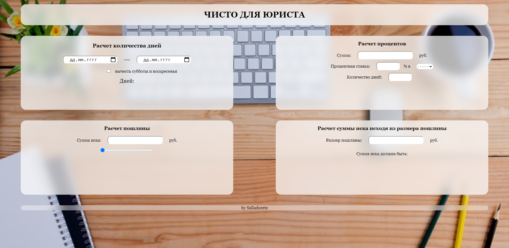
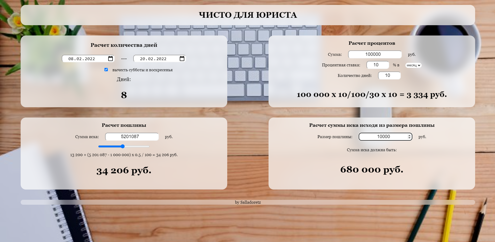

# forLawyers
Some little useful services for russian lawyers

Calculate days, percents and court fee.

Страничка для юриста.
Быстро считает количество дней в периоде (можно вычесть субботы и воскресенья), проценты за период времени, судебную пошлину (суды общей юрисдикции) и расчитывает сумму иска исходя из размера пошлины.
